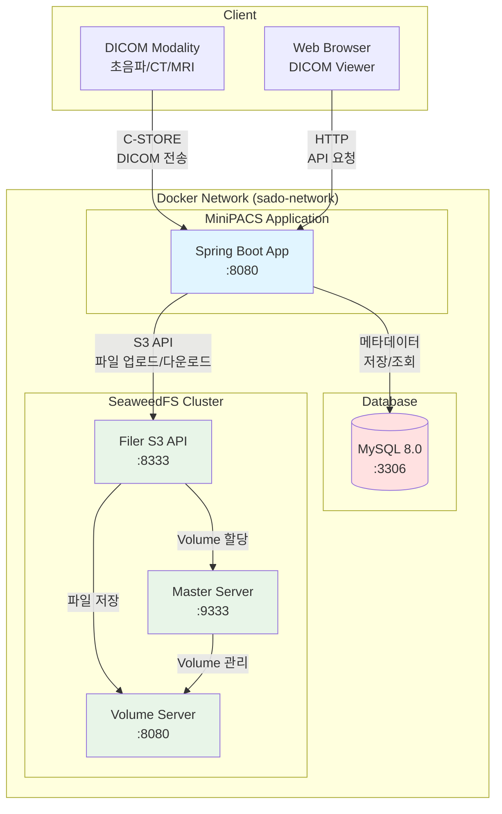
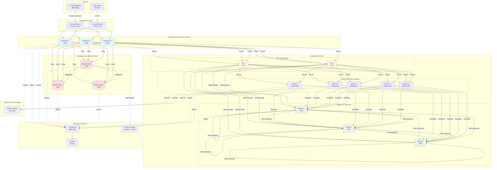

# SeaweedFS로 시작하는 분산 객체 스토리지 - DICOM PACS를 위한 선택

> **작성일**: 2025-12-28
> **카테고리**: Infrastructure, Storage
> **난이도**: 초급~중급
> **키워드**: SeaweedFS, Object Storage, DICOM, PACS, S3, Docker

---

## 들어가며

PACS(Picture Archiving and Communication System) 시스템을 개발하면서 가장 먼저 마주치는 도전 과제는 **스토리지**입니다.

DICOM 파일의 특성을 생각해보면:
- **파일 개수**: 병원 하나당 수억~수십억 개의 파일
- **파일 크기**: 수 KB (초음파 1프레임) ~ 수백 MB (CT 전체 시리즈)
- **데이터 수명**: Hot (최근 7일), Warm (1-12개월), Cold (1년+)

전통적인 파일 시스템으로는 이런 요구사항을 감당하기 어렵습니다. inode 고갈, 디렉토리 탐색 성능 저하, 백업/복구 복잡도 등 수많은 문제에 직면하게 됩니다.

**객체 스토리지(Object Storage)**가 필요한 이유:
- ✅ 수평 확장성 - 서버 추가만으로 용량/성능 증가
- ✅ S3 API 표준 - 기존 도구 및 라이브러리 활용 가능
- ✅ 클라우드 친화적 - AWS/GCP/Azure와 자연스러운 통합

이번 글에서는 **SeaweedFS**라는 분산 객체 스토리지 시스템을 소개하고, DICOM PACS 환경에서 어떻게 활용할 수 있는지 알아보겠습니다.

---

## SeaweedFS란?

### 개요

**SeaweedFS**는 수십억 개의 파일을 위한 빠른 분산 스토리지 시스템입니다.

- **정의**: Blob store, Object storage, Files, Data lake를 위한 범용 스토리지
- **특징**: O(1) 디스크 탐색, 클라우드 티어링, S3 호환성
- **영감**: Facebook Haystack 아키텍처

**GitHub**: [seaweedfs/seaweedfs](https://github.com/seaweedfs/seaweedfs)

### 핵심 아키텍처

SeaweedFS는 3가지 컴포넌트로 구성됩니다:

#### 1. Master Server

**역할**:
- Volume 관리 및 클러스터 조정
- 파일이 저장될 Volume 할당

**특징**:
- 파일 메타데이터는 저장하지 않음 → 병목 제거
- Volume 메타데이터만 관리 (안정적이고 작음)

**메모리 사용**: 매우 낮음 (Volume 정보만 메모리에 유지)

#### 2. Volume Server

**역할**:
- 실제 파일 데이터 저장
- 파일 읽기/쓰기 처리

**특징**:
- 각 파일당 16바이트 메타데이터
- 메모리에서 메타데이터 읽기 → 1번의 디스크 I/O
- Volume 크기: 각 32GB

**성능**: O(1) 디스크 탐색 (아래 설명 참조)

#### 3. Filer (Optional)

**역할**:
- 파일 시스템 인터페이스 제공
- S3 API, POSIX FUSE, WebDAV 등 지원

**기능**:
- S3 Gateway - AWS SDK 사용 가능
- POSIX Mount - 일반 파일 시스템처럼 사용
- Hadoop/Spark 통합

---

### O(1) Disk Seek의 비밀

SeaweedFS의 핵심 강점은 **O(1) 디스크 탐색**입니다. 이게 어떻게 가능할까요?

#### 기존 파일 시스템의 문제

```
파일 경로: /patient123/study456/series789/instance001.dcm
```

파일을 찾기 위한 디스크 접근:
1. `/` 디렉토리 읽기
2. `/patient123/` 디렉토리 읽기
3. `/study456/` 디렉토리 읽기
4. `/series789/` 디렉토리 읽기
5. `instance001.dcm` 파일 읽기

**총 5번의 디스크 I/O** → 디렉토리 깊이에 비례 (O(depth))

#### SeaweedFS 방식

```
파일 ID: 3,01637037d6
```

파일 ID 구조:
- `3`: Volume ID
- `01637037d6`: Volume 내 오프셋 (16진수)

파일을 찾는 과정:
1. Volume 3 파일 열기
2. 오프셋 0x01637037d6 위치로 직접 seek
3. 파일 읽기

**총 1번의 디스크 I/O** → Volume ID만 알면 즉시 접근 (O(1))

#### 효과

- ✅ **작은 파일 최적화**: 메타데이터 오버헤드 최소화 (16바이트/파일)
- ✅ **inode 고갈 해결**: 디렉토리 구조 불필요
- ✅ **SSD 성능 극대화**: 랜덤 I/O 최소화

---

### 주요 기능

| 기능 | 설명 |
|------|------|
| **S3 API** | AWS S3 호환, 기존 도구 사용 가능 (AWS SDK, s3cmd, rclone 등) |
| **Erasure Coding** | n개 조각 중 k개만으로 복구 (저장 공간 50% 절약 가능) |
| **Cloud Tiering** | 로컬 ↔ AWS/GCP/Azure 자동 이동 (Hot/Warm/Cold 데이터 분리) |
| **Replication** | Active-Active 비동기 복제, SPOF(Single Point of Failure) 없음 |
| **Encryption** | At-rest, In-transit 암호화 (HIPAA 규제 준수) |
| **Kubernetes** | K8s Operator, CSI Driver 지원 (컨테이너 환경 최적화) |

**참고 자료**:
- [SeaweedFS Architecture - DeepWiki](https://deepwiki.com/seaweedfs/seaweedfs/1.1-architecture)
- [Seaweedfs Overview 2025](https://best-of-web.builder.io/library/seaweedfs/seaweedfs)

---

## SeaweedFS vs MinIO: DICOM 이미징 관점 비교

객체 스토리지를 선택할 때 가장 많이 비교되는 두 시스템은 **SeaweedFS**와 **MinIO**입니다. DICOM 이미징 환경에서 어떤 것을 선택해야 할까요?

### 비교 표

| 항목 | SeaweedFS | MinIO |
|------|-----------|-------|
| **S3 호환성** | Core API (56개 테스트 통과) | 고급 기능 포함 (321개 테스트 통과) |
| **작은 파일 성능** | ⭐⭐⭐⭐⭐ O(1) 최적화 | ⭐⭐⭐ 다중 디스크 I/O |
| **리소스 요구사항** | 2-4 GB RAM/서버 | 4-32 GB RAM/노드 |
| **UI/관리 도구** | 기본적 웹 UI | 강력한 관리 콘솔 |
| **IAM/정책** | 기본적 접근 제어 | 고급 IAM, Lifecycle Policy |
| **DICOM 생태계** | 적음 | Orthanc 공식 지원 |

**출처**: [MinIO vs Ceph RGW vs SeaweedFS vs Garage in 2025](https://onidel.com/blog/minio-ceph-seaweedfs-garage-2025)

### DICOM 워크로드 분석

#### 파일 크기 분포

예시: 심장 초음파 검사
```
1 Study (검사) → 3 Series (시리즈) → 150 Instances (이미지)
```

- Series 1 (2-Chamber View): 50개 이미지, 각 50 KB
- Series 2 (4-Chamber View): 50개 이미지, 각 70 KB
- Series 3 (Doppler): 50개 이미지, 각 100 KB

**특성**: **작은 파일 다수** → SeaweedFS의 O(1) 최적화가 빛을 발함

#### 액세스 패턴

- **Hot (최근 7일)**: 빠른 조회 필수, 높은 IOPS
- **Warm (1-12개월)**: 간헐적 조회, 중간 성능
- **Cold (1년+)**: 아카이브, 낮은 IOPS (Cloud Tiering 활용)

### 선택 가이드

#### MinIO를 선택하세요 ✅

- **기존 소프트웨어 통합**: Orthanc DICOM Server 등과 공식 지원
- **고급 S3 기능 필요**: Versioning, Lifecycle Policy, IAM
- **엔터프라이즈급 안정성**: 검증된 프로덕션 사례 많음
- **UI 중심 운영**: 관리자 친화적 웹 콘솔

#### SeaweedFS를 선택하세요 ✅

- **작은 파일 다수**: 초음파, X-ray 등 작은 DICOM 파일 위주
- **리소스 제약 환경**: 낮은 RAM/CPU 요구사항
- **아키텍처 유연성**: 다양한 액세스 패턴 혼재
- **콜드 데이터 아카이브**: Cloud Tiering으로 비용 절감

### MiniPACS 프로젝트 선택 이유

우리 MiniPACS 프로젝트에서 SeaweedFS를 선택한 이유:

1. **학습 목적**: 작은 파일 최적화 메커니즘 이해
2. **리소스 효율성**: 개발 환경에서 낮은 부담
3. **Infrastructure 추상화**: `StorageClient` 인터페이스로 추후 MinIO 전환 가능

**참고 자료**:
- [GitHub Issue: How does this compares with MinIO?](https://github.com/chrislusf/seaweedfs/issues/1515)
- [AWS Guidance for Receiving DICOM Images in S3](https://aws.amazon.com/solutions/guidance/receiving-digital-imaging-and-communications-in-medicine-images-in-amazon-s3/)

---

## Docker로 SeaweedFS 시작하기

실습을 통해 SeaweedFS를 직접 경험해봅시다.

### 단일 서버 (개발 환경)

가장 간단한 방법으로 SeaweedFS를 시작할 수 있습니다.

#### Docker 실행

```bash
docker run --name seaweedfs \
  -d \
  -p 9333:9333 \
  -p 8080:8080 \
  -v seaweedfs-data:/data \
  chrislusf/seaweedfs server -dir="/data"
```

**포트**:
- `9333`: Master Server
- `8080`: Volume Server

#### 접속 확인

브라우저에서 접속:
- Master UI: http://localhost:9333
- Volume UI: http://localhost:8080

#### 간단한 파일 업로드 테스트

**1단계: Volume ID 할당 받기**
```bash
curl "http://localhost:9333/dir/assign"
```

**응답 예시**:
```json
{
  "fid": "3,01637037d6",
  "url": "localhost:8080",
  "publicUrl": "localhost:8080",
  "count": 1
}
```

**2단계: 파일 업로드**
```bash
curl -F "file=@test.dcm" "http://localhost:8080/3,01637037d6"
```

**3단계: 파일 다운로드**
```bash
curl "http://localhost:8080/3,01637037d6" -o downloaded.dcm
```

### Docker Compose (MiniPACS 통합용)

프로덕션에 가까운 환경을 구축해봅시다.

#### docker-compose.yml

```yaml
version: '3.8'

services:
  # MySQL (기존)
  mysql:
    image: mysql:8.0
    # ... (기존 설정)

  # SeaweedFS Master
  seaweedfs-master:
    image: chrislusf/seaweedfs:latest
    container_name: seaweedfs-master
    ports:
      - "9333:9333"
    command: master -ip=seaweedfs-master
    networks:
      - sado-network

  # SeaweedFS Volume
  seaweedfs-volume:
    image: chrislusf/seaweedfs:latest
    container_name: seaweedfs-volume
    ports:
      - "8080:8080"
    volumes:
      - seaweedfs-data:/data
    command: volume -mserver=seaweedfs-master:9333 -dir="/data"
    depends_on:
      - seaweedfs-master
    networks:
      - sado-network

  # SeaweedFS Filer (S3 API)
  seaweedfs-filer:
    image: chrislusf/seaweedfs:latest
    container_name: seaweedfs-filer
    ports:
      - "8888:8888"  # Filer HTTP
      - "8333:8333"  # S3 API
    command: filer -master=seaweedfs-master:9333 -s3
    depends_on:
      - seaweedfs-master
      - seaweedfs-volume
    networks:
      - sado-network

volumes:
  seaweedfs-data:

networks:
  sado-network:
    external: true
```

#### 실행

```bash
docker-compose up -d
```

#### S3 API 테스트

AWS CLI를 사용하여 S3 API를 테스트할 수 있습니다.

**AWS CLI 설정**:
```bash
aws configure set aws_access_key_id any
aws configure set aws_secret_access_key any
aws configure set region us-east-1
```

**버킷 생성**:
```bash
aws s3 mb s3://dicom-studies --endpoint-url http://localhost:8333
```

**파일 업로드**:
```bash
aws s3 cp test.dcm s3://dicom-studies/ --endpoint-url http://localhost:8333
```

**파일 목록 확인**:
```bash
aws s3 ls s3://dicom-studies/ --endpoint-url http://localhost:8333
```

**참고 자료**:
- [Getting Started · seaweedfs/seaweedfs Wiki](https://github.com/seaweedfs/seaweedfs/wiki/Getting-Started)
- [SeaweedFS Docker Compose Stack](https://blog.jklug.work/posts/seaweedfs/)

### 클러스터 구성 (프로덕션)

고가용성(HA) 환경을 위한 클러스터 구성 예시입니다.

#### 구성

- Master 3대 (HA, Raft 합의 알고리즘)
- Volume Server N대 (수평 확장)
- Filer 2대 (S3 API 로드 밸런싱)

#### 설정 예시

**Master 1**:
```bash
docker run -d --name master1 \
  --network seaweedfs-net \
  -p 9333:9333 \
  chrislusf/seaweedfs master \
  -ip=master1 \
  -peers=master1:9333,master2:9333,master3:9333
```

**Volume Server 1**:
```bash
docker run -d --name volume1 \
  --network seaweedfs-net \
  -p 8080:8080 \
  -v /data/volume1:/data \
  chrislusf/seaweedfs volume \
  -mserver=master1:9333,master2:9333,master3:9333 \
  -dir=/data
```

**Filer 1 (S3 API)**:
```bash
docker run -d --name filer1 \
  --network seaweedfs-net \
  -p 8888:8888 -p 8333:8333 \
  chrislusf/seaweedfs filer \
  -master=master1:9333,master2:9333,master3:9333 \
  -s3
```

---

## MiniPACS 통합 계획

이제 SeaweedFS를 MiniPACS 프로젝트에 통합하는 방법을 알아봅시다.

### Infrastructure 추상화 레이어

외부 스토리지 솔루션에 종속되지 않도록 인터페이스를 설계합니다.

#### StorageClient 인터페이스

```java
package com.hanumoka.sado.infrastructure.storage.api;

public interface StorageClient {

    /**
     * 파일 업로드
     *
     * @param path 저장 경로 (예: dicom/studies/1.2.840...)
     * @param content 파일 내용
     * @return 저장된 파일의 URL
     */
    String upload(String path, byte[] content);

    /**
     * 파일 다운로드
     *
     * @param url 파일 URL
     * @return 파일 내용
     */
    byte[] download(String url);

    /**
     * 파일 삭제
     *
     * @param url 파일 URL
     */
    void delete(String url);

    /**
     * 파일 존재 여부 확인
     *
     * @param url 파일 URL
     * @return 존재 여부
     */
    boolean exists(String url);
}
```

**설계 철학**:
- 스토리지 구현체에 독립적인 인터페이스
- SeaweedFS → MinIO → S3 전환이 비즈니스 로직 변경 없이 가능
- 테스트 시 Mock 구현체 사용 용이

### Week 4 구현 계획

MiniPACS 프로젝트의 Week 4에 SeaweedFS를 통합합니다.

#### Week 4: Storage Layer

**Day 1-2: LocalStorageClient**
```java
@Component
@ConditionalOnProperty(name = "minipacs.storage.provider", havingValue = "local")
public class LocalStorageClient implements StorageClient {

    @Value("${minipacs.storage.local.base-path}")
    private String basePath;

    @Override
    public String upload(String path, byte[] content) {
        Path filePath = Paths.get(basePath, path);
        Files.createDirectories(filePath.getParent());
        Files.write(filePath, content);
        return filePath.toString();
    }

    // ... 나머지 메서드
}
```

**Day 3-5: SeaweedFSStorageClient**
```java
@Component
@ConditionalOnProperty(name = "minipacs.storage.provider", havingValue = "seaweedfs")
public class SeaweedFSStorageClient implements StorageClient {

    private final AmazonS3 s3Client;

    @Autowired
    public SeaweedFSStorageClient(
            @Value("${minipacs.storage.seaweedfs.endpoint}") String endpoint,
            @Value("${minipacs.storage.seaweedfs.access-key}") String accessKey,
            @Value("${minipacs.storage.seaweedfs.secret-key}") String secretKey,
            @Value("${minipacs.storage.seaweedfs.bucket}") String bucket) {

        // AWS SDK for Java 사용
        this.s3Client = AmazonS3ClientBuilder.standard()
            .withEndpointConfiguration(
                new EndpointConfiguration(endpoint, "us-east-1"))
            .withCredentials(
                new AWSStaticCredentialsProvider(
                    new BasicAWSCredentials(accessKey, secretKey)))
            .withPathStyleAccessEnabled(true)
            .build();
    }

    @Override
    public String upload(String path, byte[] content) {
        s3Client.putObject(bucket, path, new ByteArrayInputStream(content), null);
        return String.format("s3://%s/%s", bucket, path);
    }

    // ... 나머지 메서드
}
```

#### 설정 파일 (application.yml)

```yaml
minipacs:
  storage:
    provider: seaweedfs  # local, seaweedfs, s3

    local:
      base-path: /tmp/dicom-storage

    seaweedfs:
      endpoint: http://localhost:8333
      access-key: any
      secret-key: any
      bucket: dicom-studies
```

#### Bean 등록

```java
@Configuration
public class StorageConfig {

    @Bean
    @ConditionalOnProperty(name = "minipacs.storage.provider", havingValue = "local")
    public StorageClient localStorageClient() {
        return new LocalStorageClient();
    }

    @Bean
    @ConditionalOnProperty(name = "minipacs.storage.provider", havingValue = "seaweedfs")
    public StorageClient seaweedFSStorageClient(
            @Value("${minipacs.storage.seaweedfs.endpoint}") String endpoint,
            @Value("${minipacs.storage.seaweedfs.access-key}") String accessKey,
            @Value("${minipacs.storage.seaweedfs.secret-key}") String secretKey,
            @Value("${minipacs.storage.seaweedfs.bucket}") String bucket) {
        return new SeaweedFSStorageClient(endpoint, accessKey, secretKey, bucket);
    }
}
```

**장점**:
- `application.yml`의 `provider` 값만 변경하면 구현체 전환
- 비즈니스 로직은 `StorageClient` 인터페이스만 의존
- 테스트 시 MockStorageClient 사용 가능

### DICOM 파일 저장 흐름

```
C-STORE 수신 (DICOM 네트워크)
    ↓
DICOM 메타데이터 추출 (dcm4che 라이브러리)
    ↓
DicomMetadataRecord 생성 (DB에 JSON 저장)
    ↓
파일 저장 (StorageClient.upload)
    ↓ SeaweedFS S3 API
SeaweedFS Volume Server (실제 파일 저장)
    ↓
Instance 엔티티 생성 (filePath = S3 URL)
```

#### 파일 경로 구조

```
s3://dicom-studies/
  └── tenant_1/
      └── study_1.2.840.113619.2.55.3.1234567890/
          └── series_1.2.840.113619.2.55.3.1234567890.1/
              ├── instance_1.2.840.113619.2.55.3.1234567890.1.1.dcm
              ├── instance_1.2.840.113619.2.55.3.1234567890.1.2.dcm
              └── ...
```

**설계 포인트**:
- **tenant_id 분리**: 멀티테넌시 지원
- **DICOM UID 기반**: 계층 구조 유지 (Study → Series → Instance)
- **S3 URL 저장**: Instance.filePath에 전체 URL 저장

---

## 시스템 아키텍처

### POC/개발 환경 구조

개발 및 POC 환경에서의 MiniPACS + SeaweedFS 구조입니다.

#### 시스템 구성도



#### 구성 요소

| 컴포넌트 | 역할 | 포트 | 리소스 |
|----------|------|------|--------|
| **MiniPACS** | DICOM C-STORE 수신, API 제공 | 8080, 11112 (DICOM) | 1 vCPU, 2 GB RAM |
| **MySQL** | 메타데이터 저장 (Study, Series, Instance) | 3306 | 1 vCPU, 2 GB RAM |
| **SeaweedFS Master** | Volume 관리, 클러스터 조정 | 9333 | 0.5 vCPU, 512 MB RAM |
| **SeaweedFS Volume** | 실제 DICOM 파일 저장 | 8080 | 1 vCPU, 2 GB RAM, 100 GB Storage |
| **SeaweedFS Filer** | S3 API 제공 | 8333, 8888 | 0.5 vCPU, 1 GB RAM |

**총 리소스**: 4 vCPU, 7.5 GB RAM, 100 GB Storage

#### 특징

- ✅ **단일 호스트 배포**: Docker Compose로 모든 컴포넌트 실행
- ✅ **개발 편의성**: 로컬 환경에서 전체 시스템 테스트 가능
- ✅ **낮은 리소스**: 개발용 노트북에서도 실행 가능
- ⚠️ **단일 장애점(SPOF)**: 호스트 다운 시 전체 서비스 중단
- ⚠️ **데이터 보호 미흡**: 복제/백업 없음

---

### 운영 환경 고려사항

프로덕션 환경에서는 다음 사항들을 고려해야 합니다.

#### 1. 고가용성 (High Availability)

**문제**: 단일 장애점 제거

**해결 방안**:
- **SeaweedFS Master**: 3대 이상 (Raft 합의 알고리즘)
- **SeaweedFS Volume**: N대 (복제 계수 2 이상)
- **SeaweedFS Filer**: 2대 이상 (로드 밸런서)
- **MiniPACS**: 2대 이상 (로드 밸런서)
- **MySQL**: Master-Slave 복제 또는 Galera Cluster

**효과**:
- 서버 1대 다운 시에도 서비스 지속
- Master 선출: 자동 Failover (30초 이내)

#### 2. 데이터 복제 및 백업

**문제**: 데이터 손실 방지

**해결 방안**:
- **SeaweedFS Replication**: `001` (복제 계수 2)
  - 같은 데이터를 2개 Volume에 저장
  - 1개 Volume 장애 시 자동 복구
- **Erasure Coding**: `10.4` (10개 조각 중 4개 복구 가능)
  - 저장 공간 40% 절약
  - 4대 서버 다운까지 복구 가능
- **MySQL 백업**: 매일 자동 백업 (mysqldump, Percona XtraBackup)
- **Cloud Tiering**: Cold 데이터를 S3 Glacier로 이동

#### 3. 모니터링 및 알림

**문제**: 장애 조기 감지

**해결 방안**:
- **Prometheus**: 메트릭 수집
  - SeaweedFS: Volume 용량, IOPS, 레이턴시
  - MySQL: Connection, Query 성능
  - MiniPACS: API 응답 시간, C-STORE 처리량
- **Grafana**: 대시보드 시각화
- **Alertmanager**: 임계치 초과 시 알림 (Slack, Email)

**주요 메트릭**:
- Volume 용량 사용률 > 80%
- API 응답 시간 > 1초
- MySQL Replication Lag > 10초

#### 4. 보안 (HIPAA 규제 준수)

**문제**: 의료 데이터 보호

**해결 방안**:
- **At-rest 암호화**: SeaweedFS Volume 암호화
- **In-transit 암호화**: TLS 1.3 (HTTPS, DICOM TLS)
- **접근 제어**: IAM 정책, S3 Bucket Policy
- **감사 로그**: 모든 접근 기록 (CloudTrail, SeaweedFS Audit)
- **네트워크 격리**: Private Subnet, VPN

**HIPAA 체크리스트**:
- ✅ 암호화 (AES-256)
- ✅ 접근 로그 (6년 보관)
- ✅ 인증 및 권한 관리
- ✅ 정기 보안 감사

#### 5. 성능 최적화

**문제**: 대량 DICOM 파일 처리

**해결 방안**:
- **Volume 분산**: 각 Volume Server에 여러 Volume 배치
- **SSD 사용**: 랜덤 I/O 성능 극대화
- **네트워크**: 10 Gbps 이상 (Volume Server 간)
- **캐싱**: Redis Cache (메타데이터 조회)
- **비동기 처리**: Redis Stream (DICOM Ingest Queue)

**성능 목표**:
- C-STORE 수신: 100 files/sec
- API 응답 시간: < 200ms (P95)
- WADO-RS 다운로드: 50 MB/sec

#### 6. 재해 복구 (Disaster Recovery)

**문제**: 데이터 센터 장애

**해решение 방안**:
- **다중 리전 복제**: SeaweedFS Cross-DC Replication
- **백업 센터**: 원격지 백업 (AWS S3, GCP)
- **RPO (Recovery Point Objective)**: < 1시간 (증분 백업)
- **RTO (Recovery Time Objective)**: < 4시간 (복구 시간)

**DR 시나리오**:
1. Primary DC 다운
2. DNS Failover → Secondary DC (5분)
3. SeaweedFS Volume Sync (자동)
4. 서비스 재개 (4시간 이내)

---

### 운영 환경 시스템 구조

프로덕션급 MiniPACS + SeaweedFS 클러스터 구조입니다.

#### 시스템 구성도



#### 구성 요소 상세

##### Application Layer
| 컴포넌트 | 개수 | 역할 | 리소스 |
|----------|------|------|--------|
| **L4 Load Balancer** | 2 (Active-Standby) | DICOM 트래픽 분산 | 2 vCPU, 4 GB RAM |
| **L7 Load Balancer** | 2 (Active-Active) | HTTP/S 트래픽 분산, SSL Termination | 2 vCPU, 4 GB RAM |
| **MiniPACS** | 3+ | DICOM C-STORE, REST API | 각 4 vCPU, 8 GB RAM |

##### Database Layer
| 컴포넌트 | 개수 | 역할 | 리소스 |
|----------|------|------|--------|
| **MySQL Master** | 1 | 쓰기 전용 | 8 vCPU, 16 GB RAM, 500 GB SSD |
| **MySQL Slave** | 2+ | 읽기 전용 (복제) | 각 4 vCPU, 8 GB RAM, 500 GB SSD |

##### SeaweedFS Cluster
| 컴포넌트 | 개수 | 역할 | 리소스 |
|----------|------|------|--------|
| **Master** | 3 (Raft HA) | Volume 관리, 리더 선출 | 각 2 vCPU, 2 GB RAM |
| **Filer** | 2+ | S3 API, 메타데이터 관리 | 각 2 vCPU, 4 GB RAM |
| **Volume** | 10+ | 실제 파일 저장 | 각 4 vCPU, 8 GB RAM, 1 TB NVMe SSD |

**총 리소스 (최소)**:
- **vCPU**: 60+
- **RAM**: 120+ GB
- **Storage**: 10+ TB (SSD)

#### 데이터 보호 전략

**복제 설정**: `001` (같은 데이터를 2개 Volume에 저장)

```
Instance 파일 업로드
    ↓
Master: Volume 2개 할당 (Volume-1, Volume-3)
    ↓
Filer: 병렬 쓰기
    ├─→ Volume-1 저장 (Primary)
    └─→ Volume-3 저장 (Replica)
```

**장애 시나리오**:
- Volume-1 다운 → Volume-3에서 즉시 서비스 (자동 Failover)
- Volume-1 복구 → 자동 동기화 (Catch-up Replication)

**Erasure Coding 예시**: `10.4`

```
파일 크기: 100 MB
    ↓
10개 조각으로 분할 (각 10 MB)
    ↓
4개 Parity 조각 생성
    ↓
총 14개 조각을 14대 Volume Server에 분산 저장
    ↓
10대 서버 중 4대 다운까지 복구 가능
저장 공간: 100 MB × 1.4 = 140 MB (40% 오버헤드)
```

**비교**:
- 복제 `001`: 100 MB × 2 = 200 MB (100% 오버헤드)
- Erasure Coding `10.4`: 100 MB × 1.4 = 140 MB (40% 오버헤드)
- **절감**: 30% 저장 공간 절약

#### 성능 최적화

**Volume 배치 전략**:
```
Volume Server 1: Volume-1, Volume-5, Volume-9  (3개)
Volume Server 2: Volume-2, Volume-6, Volume-10 (3개)
Volume Server 3: Volume-3, Volume-7, Volume-11 (3개)
...
```

**효과**:
- I/O 분산: 여러 Volume에 동시 쓰기/읽기
- 단일 서버 병목 회피
- 수평 확장 용이 (Volume Server 추가만으로 성능 증가)

#### 모니터링 대시보드

**Grafana 패널**:

1. **SeaweedFS Cluster Health**
   - Master 상태 (Leader, Follower)
   - Volume 용량 사용률
   - Filer 응답 시간

2. **Performance Metrics**
   - IOPS (Input/Output Operations Per Second)
   - Throughput (MB/s)
   - Latency (P50, P95, P99)

3. **MySQL Replication**
   - Replication Lag (초)
   - Slow Query Count
   - Connection Pool 사용률

4. **Application Metrics**
   - C-STORE 처리량 (files/sec)
   - API 응답 시간 (ms)
   - Error Rate (%)

#### 비용 예상 (AWS 기준)

**인스턴스** (1년 예약):
- MiniPACS (3대 × c5.xlarge): $1,200/월
- MySQL (3대 × r5.2xlarge): $2,400/월
- SeaweedFS Master (3대 × t3.medium): $90/월
- SeaweedFS Filer (2대 × c5.large): $140/월
- SeaweedFS Volume (10대 × i3.2xlarge): $6,000/월

**스토리지** (10 TB):
- EBS SSD (gp3): $800/월
- S3 Glacier (Cold Tier, 100 TB): $400/월

**네트워크**:
- Data Transfer: $500/월

**총 비용**: ~$11,530/월 (~$138,360/년)

**비용 절감 방안**:
- Erasure Coding: 30% 절감 → $10,000/월
- On-Premise 구축: 초기 투자 高, 장기 運用 低
- Cloud Tiering: Hot → S3 Standard, Cold → Glacier

---

## 마무리

### 학습 포인트

이번 글을 통해 다음 개념들을 학습했습니다:

**핵심 개념**:
- ✅ SeaweedFS의 O(1) disk seek 원리 (Volume + Offset 직접 접근)
- ✅ Master-Volume-Filer 아키텍처 (병목 제거, 수평 확장)
- ✅ S3 호환성과 Infrastructure 추상화 (벤더 종속성 제거)

**DICOM PACS 적용**:
- ✅ 작은 파일 최적화의 중요성 (초음파, X-ray 등)
- ✅ Hot/Warm/Cold 데이터 전략 (Cloud Tiering 활용)
- ✅ 클라우드 친화적 아키텍처 (S3 API 표준)

### 다음 단계

#### Week 4 실습 (예정)

1. **SeaweedFS Docker Compose 추가**
   - `docker-compose.yml`에 Master, Volume, Filer 추가
   - MySQL과 동일한 네트워크로 연결

2. **StorageClient 인터페이스 구현**
   - LocalStorageClient (개발 환경)
   - SeaweedFSStorageClient (통합 테스트)

3. **DICOM 파일 업로드 API 테스트**
   - C-STORE 시뮬레이터로 파일 전송
   - SeaweedFS에 저장 확인
   - Instance 엔티티 생성 확인

#### 추가 학습 주제

- **Erasure Coding 상세**: 데이터 복구 메커니즘, 저장 공간 절약 전략
- **Filer 메타데이터 저장소**: PostgreSQL, Redis, LevelDB 비교
- **모니터링**: Prometheus, Grafana로 성능 추적

#### 블로그 시리즈 예고

- "SeaweedFS Erasure Coding으로 스토리지 비용 50% 절감하기"
- "DICOM Ingest Pipeline 구현 - SeaweedFS + Redis Stream"
- "MiniPACS Cloud Tiering 전략 - Hot/Warm/Cold 데이터 분리"

---

## 참고 자료

### SeaweedFS 공식 문서
1. [GitHub - seaweedfs/seaweedfs](https://github.com/seaweedfs/seaweedfs)
2. [Architecture | seaweedfs/seaweedfs | DeepWiki](https://deepwiki.com/seaweedfs/seaweedfs/1.1-architecture)
3. [Getting Started · seaweedfs/seaweedfs Wiki](https://github.com/seaweedfs/seaweedfs/wiki/Getting-Started)
4. [Docker Hub - chrislusf/seaweedfs](https://hub.docker.com/r/chrislusf/seaweedfs)

### 비교 분석
5. [MinIO vs Ceph RGW vs SeaweedFS vs Garage in 2025](https://onidel.com/blog/minio-ceph-seaweedfs-garage-2025)
6. [GitHub Issue #1515: How does this compares with MinIO?](https://github.com/chrislusf/seaweedfs/issues/1515)
7. [Seaweedfs Overview 2025](https://best-of-web.builder.io/library/seaweedfs/seaweedfs)

### DICOM 및 S3 Storage
8. [AWS Guidance for Receiving DICOM Images in S3](https://aws.amazon.com/solutions/guidance/receiving-digital-imaging-and-communications-in-medicine-images-in-amazon-s3/)
9. [GitHub - radpointhq/orthanc-s3-storage](https://github.com/radpointhq/orthanc-s3-storage)

### Docker 튜토리얼
10. [SeaweedFS (Object Storage) - Docker Compose Stack](https://blog.jklug.work/posts/seaweedfs/)

---

**작성일**: 2025-12-28
**예상 독자**: DICOM PACS 개발자, 백엔드 개발자, Infrastructure 엔지니어
**난이도**: 초급~중급
**예상 소요 시간**: 30-40분 읽기, 1-2시간 실습

---

**다음 글 예고**: "SeaweedFS Erasure Coding으로 스토리지 비용 50% 절감하기"
